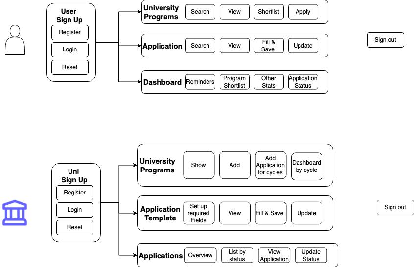

# INFO6150 - Final Project 🚀

**Team Byte Me **

## 👓 Team Members

1. Aditya
2. Avaneesh
3. Kashish
4. Swapnil

## 🔊 Problem Statement

An University application portal that allows **Students** to plan, apply & track applications & **Universities** to look at students applications.

## 📜 User Requirements

Note: Italicized requirements are not for MVP

**As a Student I should be able to:**

1. Sign up to the portal
2. Login to the Portal
3. Reset password when I forget it
4. Fill & Update in my basic details that could ease application process
5. Shortlist Various Universities
6. Apply to different universities on the portal
7. _Add Application documents & progress for universities I'm applying outside the portal_
8. View Dashboard to track progress

**As a University:**

1. Sign up to the portal from an admin
2. Ability to assign selected users to view & accept applications specific to various programs.
3. View dashboard that gives an update on what's happening with applications across various programs.
4. Program specific dashboard that gives an overview of program applications
5. Able to move application through various stages Eg: In Review, Approved

## MVP

**Student**

1. SignUp & Login
2. Profile Information Forms - Post Signup
3. View Programs
4. Create, Update, Delete, Submit Application
5. Application Dashboard
6. Application Notifications

**University User**

1. SignUp & Login
2. Review, Accept, Reject Applications

## 📦 Domain Model

## 🖇️ Useful Links

- [Color Schema](https://colorkit.co/color-palette-generator/e6a900-ffbc00-b38400-ffeebf-ffde80/)
